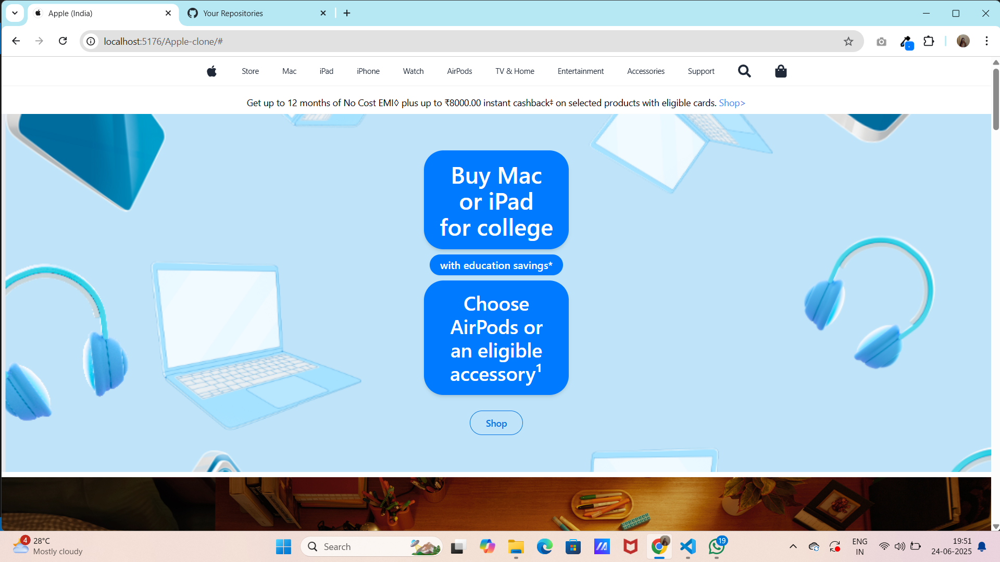
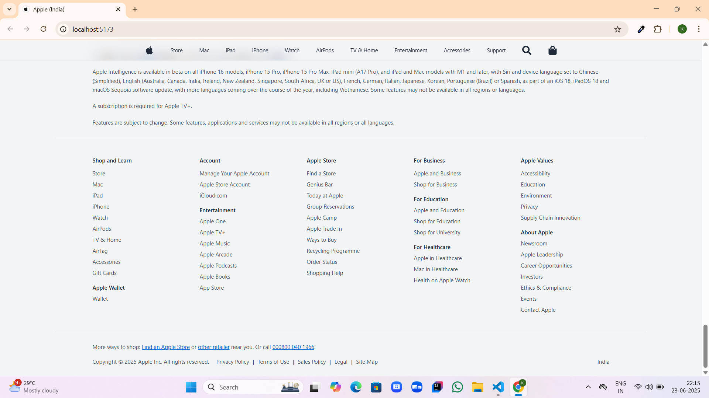

# Apple Clone Website

This is a fully responsive and elegant Apple Clone Website built using **React**, **Tailwind CSS**, and **Vite**. The project recreates the modern Apple UI, showcasing promotional banners, sliders, product highlights, and a clean layout—similar to Apple's official homepage.

## Features

- **Top Bar and Navbar**  
  Simple and minimal top navigation with hover effects and smooth layout.

- **Promo Banner**  
  Apple-style promotional banner with a clickable call-to-action.

- **Hero Sections**  
  Eye-catching hero sections for devices like MacBook, iPhone, and iPad.

- **Image Slider**  
  Responsive and auto-changing slider with desktop and mobile versions.

- **Product Highlights**  
  Apple-style product sections organized clearly for user engagement.

- **Responsive Footer**  
  Clean and adaptive footer layout using Tailwind CSS.

- **Mobile First Design**  
  Fully responsive layout for all screen sizes, including tablets and phones.

## Technologies Used

- React.js  
- Tailwind CSS  
- Vite  
- CSS Modules (optional)  
- Responsive Web Design

## Folder Structure

Apple-Clone/
│
├── public/
│ └── vite.svg
│
├── src/
│ ├── assets/
│ │ ├── images/ # UI and product images
│ │ └── Screenshots/ # Project screenshots
│ │ ├── Homelg.png
│ │ ├── Homesm.png
│ │ ├── Footerlg.png
│ │ └── ...
│ │
│ ├── components/ # React components
│ │ ├── TopBar.jsx
│ │ ├── Navbar.jsx
│ │ ├── PromoBanner.jsx
│ │ ├── HeroSection.jsx
│ │ ├── Hero2.jsx
│ │ ├── Hero3.jsx
│ │ ├── AppleSections.jsx
│ │ └── Slider.jsx
│ │
│ ├── App.jsx # Main application file
│ ├── main.jsx # React DOM render file
│ ├── App.css # Global styling
│ └── index.css # Tailwind base imports
│
├── .gitignore
├── index.html
├── package.json
├── postcss.config.js
├── tailwind.config.js
├── vite.config.js
└── README.md

## Screenshots

### 1. Home Page (Desktop)

### 3. Footer

### 4. Responsive Layout

## Author

Developed by [Manjushree V](https://github.com/Manjushree8)

## Live Demo

Visit the live site: [Apple Clone Website](https://karthigap20.github.io/Apple-Clone/)

## Feedback

Thank you for checking out this project.  
Feel free to open issues or give suggestions for improvement.

Made with React, Tailwind CSS, and Vite.
